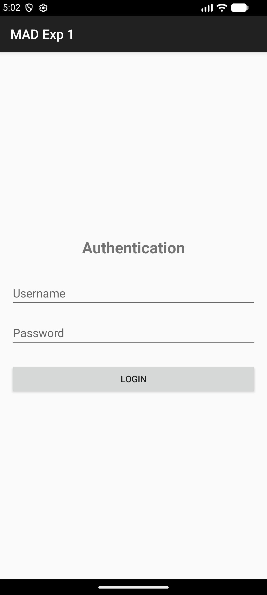
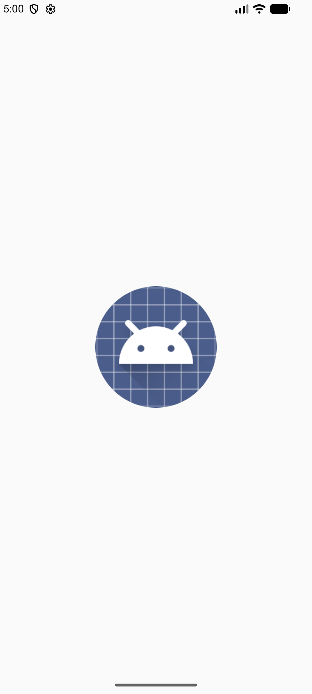

# Experiment 1: Authentication & Dashboard Implementation

## Overview
This experiment demonstrates the development of a basic Android application using Kotlin and XML layouts. The application features a secure entry point (Authentication/Login) that navigates to a personalized Dashboard using Android Intents.

## Concept & Technology
- **Kotlin:** Primary programming language.
- **XML Layouts:** Responsive UI design.
- **Intents:** Navigation between `LoginActivity` and `DashboardActivity`.
- **UI Components:** `EditText`, `Button`, `TextView`, and `LinearLayout`.

## Project Structure
```
Experiment 01/
├── app/
│   ├── src/main/
│   │   ├── java/com/example/madlab/experiment1/
│   │   │   ├── LoginActivity.kt
│   │   │   └── DashboardActivity.kt
│   │   ├── res/layout/
│   │   │   ├── activity_login.xml
│   │   │   └── activity_dashboard.xml
│   │   └── AndroidManifest.xml
│   └── build.gradle
├── build.gradle
├── settings.gradle
└── README.md
```

## Test Cases & Screenshots

### 1. Authentication Page


### 2. Test Case 1: Student Identity
- **Name:** Mrigank Shukla
- **USN:** 25MCAR0109


### 3. Test Case 2: Experiment Info


### 4. Test Case 3: System Status

