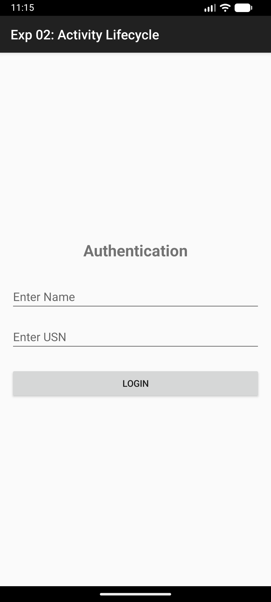
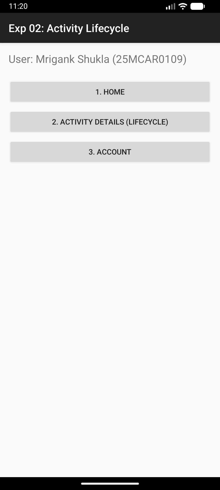
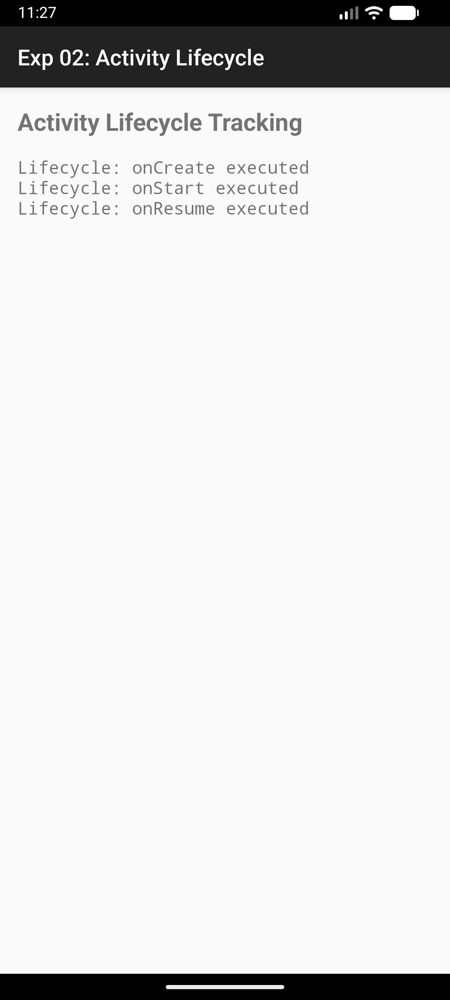

# Experiment 02: Activity Lifecycle

## Overview
This experiment demonstrates the Android Activity Lifecycle. It tracks and displays state changes when an activity is created, started, resumed, paused, stopped, and destroyed.

## Concept & Technology
- **Activity Lifecycle:** Understanding `onCreate`, `onStart`, `onResume`, `onPause`, `onStop`, `onRestart`, and `onDestroy`.
- **Intents:** Navigating between Login, Dashboard, and Lifecycle tracking activities.
- **UI Components:** Using `ScrollView` and `TextView` to display dynamic logs.

## Scenario
1. **Authentication:** User enters Name and USN.
2. **Dashboard:** Provides three navigation options (Home, Activity Details, Account).
3. **Lifecycle Tracking:** In the "Activity Details" section, every lifecycle event is logged with a unique descriptive message and student identity.

## Custom Messages
For each method call, the following custom message is displayed:
- **Header:** `Name: Mrigank Shukla | USN: 25MCAR0109`
- **Descriptions:**
    - `onCreate`: "System is creating the Activity."
    - `onResume`: "Activity is now interactive (Foreground)."
    - ... and others.

## Demo Video
The following video shows the full application flow, from authentication to activity lifecycle tracking.

[Download/Watch Demo Video](demo_exp2.mp4)

## Test Cases & Screenshots

### 1. Authentication Page

### 2. Dashboard

### 3. Activity Lifecycle Tracking (Updated)
Captured logs showing the execution of lifecycle methods with custom descriptions.

---
**Developer:** Mrigank Shukla  
**USN:** 25MCAR0109
