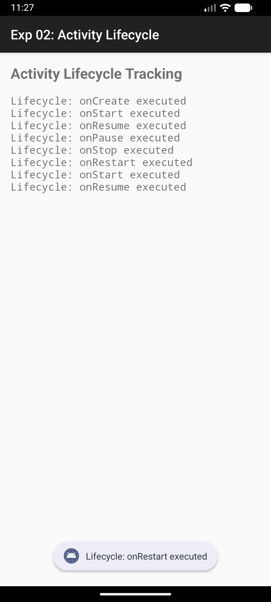

# Experiment 02: Activity Lifecycle

## Overview
This experiment demonstrates the Android Activity Lifecycle. It tracks and displays state changes when an activity is created, started, resumed, paused, stopped, and destroyed.

## Concept & Technology
- **Activity Lifecycle:** Understanding `onCreate`, `onStart`, `onResume`, `onPause`, `onStop`, `onRestart`, and `onDestroy`.
- **Intents:** Navigating between Login, Dashboard, and Lifecycle tracking activities.
- **UI Components:** Using `ScrollView` and `TextView` to display dynamic logs.

## Scenario
1. **Authentication:** User enters Name and USN.
2. **Dashboard:** Provides three navigation options (Home, Activity Details, Account).
3. **Lifecycle Tracking:** In the "Activity Details" section, every lifecycle event is logged to the screen and system logs (Logcat).

## Test Cases & Screenshots

### 1. Authentication Page

### 2. Dashboard
Displays the user's name and USN with navigation options.

### 3. Activity Lifecycle Tracking
Shows the sequence of methods executed during transitions.
- **Initial Start:** `onCreate` -> `onStart` -> `onResume`.

- **After Resuming from Background:** `onRestart` -> `onStart` -> `onResume`.

---
**Developer:** Mrigank Shukla  
**USN:** 25MCAR0109
