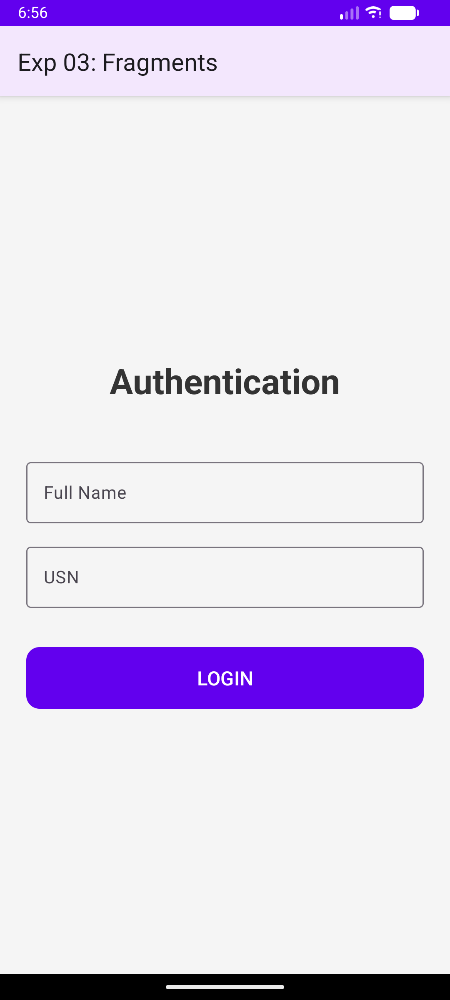
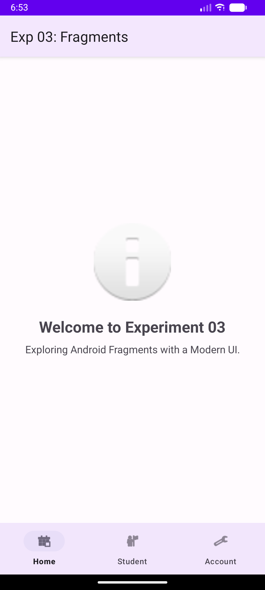
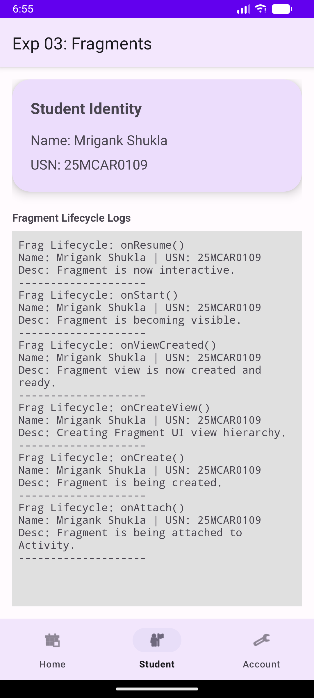

# Experiment 03: Fragments & Modern UI

## Overview
This experiment builds on the previous one by implementing a flexible user interface using **Android Fragments**. It features a modern design utilizing Material 3 components and a single-activity architecture for the main dashboard.

## Concept & Technology
- **Fragments:** Used to create modular UI sections (`HomeFragment`, `StudentDetailsFragment`, `AccountFragment`).
- **Modern UI (Material 3):** Implementation of `TextInputLayout`, `MaterialButton`, and `MaterialCardView` for a polished look.
- **Bottom Navigation:** A centralized `BottomNavigationView` in `DashboardActivity` to swap fragments dynamically.
- **View Binding:** Enabled for safe and efficient UI interactions.
- **Fragment Lifecycle:** Tracking of fragment-specific states (`onAttach`, `onCreateView`, `onViewCreated`, etc.) with custom messages.

## Scenario
1. **Modern Authentication:** A clean, Material 3 login screen.
2. **Dashboard Hub:** A single activity hosting multiple fragments.
3. **Student Details:** Displays the developer's identity in a card and logs the fragment's lifecycle events live.

## Custom Messages (Lifecycle)
Every lifecycle transition in the `StudentDetailsFragment` displays:
- **Identity:** `Name: Mrigank Shukla | USN: 25MCAR0109`
- **Context:** A clear description of the current fragment state.

## Demo Video
The following video demonstrates the modern UI and fragment transitions.

<video src="demo_exp3.mp4" width="320" height="640" controls></video>

*If the video above doesn't load, you can [view it directly here](demo_exp3.mp4).*

## Test Cases & Screenshots

### 1. Modern Authentication Page

### 2. Dashboard (Home Fragment)

### 3. Student Details (Fragment Lifecycle)

---
**Developer:** Mrigank Shukla  
**USN:** 25MCAR0109
